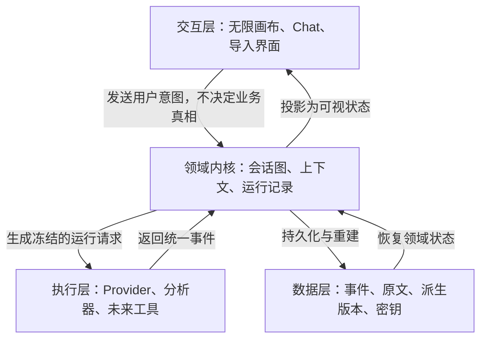
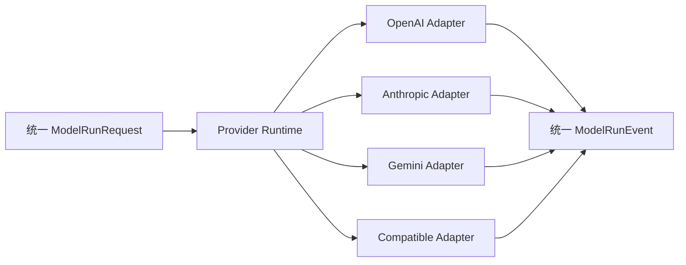
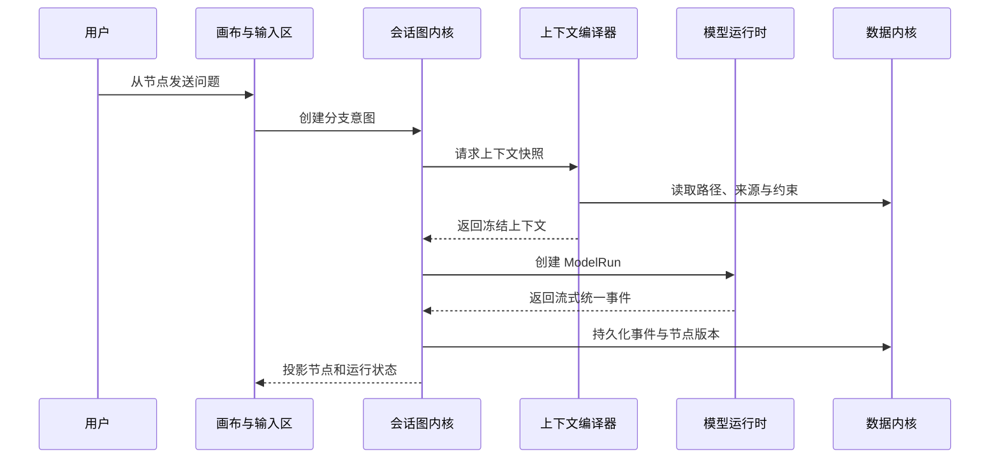
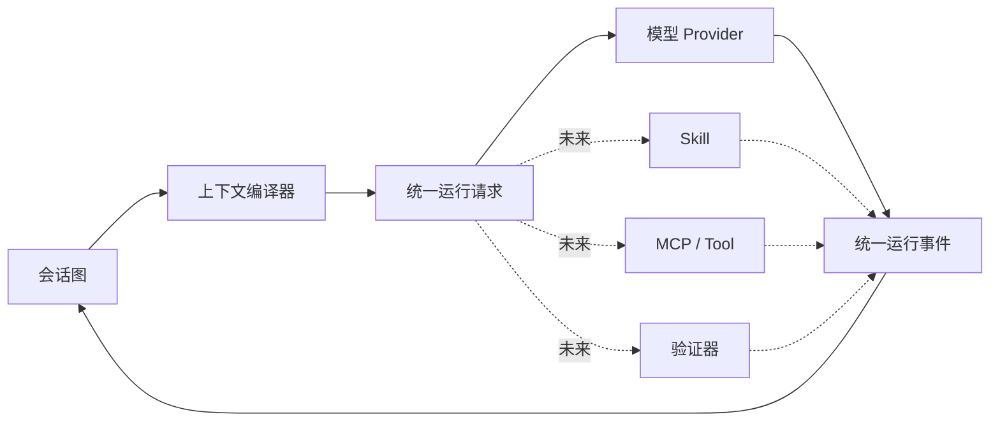

# MindScape 产品内核与工程总览

> 文档性质：工程共同认知与核心架构说明  
> 版本：V1.0 Draft  
> 日期：2026-08-14  
> 适用对象：产品、设计、前端、桌面端、后端、AI、数据与测试工程师  
> 配套范围：[第一版产品规划与范围边界](v1-product-scope.md)

## 1. 这份文档解决什么问题

第一版范围文档回答“现在做什么、不做什么”。本文件回答另一组更基础的问题：

- MindScape 的产品内核究竟是什么？
- 无限画布、Chat、导入器和模型 API 之间是什么关系？
- 哪些数据是事实，哪些只是分析结果？
- 从某个节点继续时，AI 到底应该获得什么上下文？
- 多个工程组如何并行，而不把业务逻辑分别写进 UI、数据库和模型适配器？
- 第一版怎样保持简单，同时为未来 Skill、MCP 和认知工具留下正确扩展点？

所有工程师在设计数据结构、接口和组件前，都应该先理解这份文档。

## 2. 一句话定义内核

> MindScape 的内核是一个可追溯的会话图运行时：它保存原始事件和来源，用显式关系组织会话分支，为每次模型调用编译准确上下文，并允许不同模型在同一工作状态上继续运行。

可以用下面的公式理解：

```text
MindScape Core
= 不可变来源与事件
+ 可持久化会话图
+ 可重建上下文
+ 可替换模型运行时
+ 可验证派生层
```

这里没有“无限画布”这个词，因为画布是内核的主要交互表现，不是内核本身；也没有某个具体模型名称，因为模型是可替换的执行引擎。

## 3. 产品核心不是什么

### 不是一张漂亮的思维导图

普通思维导图的节点通常是静态文本。MindScape 节点是可继续运行的会话状态，知道自己的来源、上下文路径、模型、输入和输出。

### 不是套在模型外面的聊天皮肤

如果产品只是把不同模型放进同一个输入框，厂商官方客户端很容易替代它。MindScape 必须保留跨模型、跨平台的状态、关系、来源和接续能力。

### 不是一个超长系统提示词

产品行为不能依赖一段越来越长的隐藏提示。权限、状态、数据边界、上下文选择、错误和恢复必须由确定性系统负责。

### 不是 AI IDE

代码可以是会话内容，但第一版内核不包含终端、代码仓库自治、测试、提交和部署循环。MindScape 的核心任务是理解、探索、迁移和继续 AI 会话。

### 不是把全部历史塞给模型

画布可以很大，但每次模型调用只应该获得当前分支真正需要的上下文。保存全部历史和发送全部历史是两个不同问题。

## 4. 工程师必须记住的四层关系



### 交互层

负责让用户看见和操作会话图，包括节点、连线、输入、模型选择、导入预览和状态反馈。交互层不得自行决定上下文继承、导入真实性或模型错误语义。

### 领域内核

负责会话、节点、边、上下文、导入来源、派生版本和模型运行记录。所有关键业务规则只能在这一层定义一次。

### 执行层

负责调用不同模型、运行导入分析，以及未来调用 Skill、MCP 和认知工具。执行层接收内核准备好的请求，返回统一事件，不直接操纵画布。

### 数据层

负责可靠保存、事务、迁移、内容指纹、安全凭据和恢复。数据层不推断用户意图，也不把分析结果当成原始事实。

## 5. 内核的七个核心组件

### 5.1 事件账本 Event Ledger

事件账本记录系统中已经发生的事实：

- 用户发送了消息。
- 模型开始、增量输出、完成、停止或失败。
- 用户创建、移动、连接或删除了节点。
- 文件被导入并完成格式解析。
- 用户选择了某种分析档位。
- 派生分析被创建、修正、失效或删除。
- 模型配置发生变化。

事件是不可变的。需要纠正时添加新事件，不回头伪造旧事件。

事件账本的价值：

- 异常退出后恢复未完成状态。
- 解释某个节点为什么存在。
- 重新构建会话图和分析层。
- 调试跨模块问题。
- 支持未来审计、撤销和算法升级后的重算。

第一版不要求把每次鼠标移动都保存成领域事件。只记录影响用户工作结果、数据状态或可恢复性的事件。

### 5.2 会话图 Conversation Graph

会话图是第一版最重要的领域模型。

```text
ConversationGraph
├── Node：一次完整问答或一个明确的会话状态
├── Edge：节点之间的语义关系
├── Source：节点所依据的来源
└── ViewState：画布位置、缩放和选中状态
```

必须区分两类状态：

- **语义状态**：节点内容、父节点、分支类型、模型、来源。属于领域内核。
- **视图状态**：节点坐标、缩放、窗口位置、面板开关。属于 UI 投影。

视图状态丢失不应损坏会话语义。更换画布渲染器也不应改变节点关系。

#### 节点 Node

第一版中，一个节点代表一次完整的用户问题与 AI 回答。它至少包含：

```text
Node ID
Conversation ID
User Message
Assistant Message / Current Run State
Parent Node ID
Branch Type
Provider + Model
Context Snapshot ID
Import Source / Evidence Refs
Created At / Updated At
Revision
```

#### 边 Edge

边不是装饰线，必须表达明确语义：

- `deepens`：在当前结论上继续深入。
- `diverges`：共享背景但探索新的相关方向。
- `reframes`：共享上游问题，但不接受当前回答作为前提。
- `continues`：普通线性接续。
- `imported_from`：来自外部会话或历史节点。

UI 可以使用“深入、发散、换角度”等用户语言，数据层使用稳定枚举和版本。

### 5.3 上下文编译器 Context Compiler

上下文编译器是 MindScape 与普通画布产品之间最关键的区别。

它负责把“用户从这个节点继续”转换为一次可执行、可检查的模型上下文包，而不是让 UI 自己拼消息数组。

第一版上下文来源按优先级包括：

1. 当前用户输入。
2. 当前节点与从根到当前节点的有效路径。
3. 用户明确固定的约束或背景。
4. 导入会话的原文轨或接续轨。
5. 必要的产品协议与安全边界。

上下文编译器输出一个冻结快照：

```text
ContextSnapshot
├── current_input
├── selected_message_refs
├── selected_import_refs
├── explicit_constraints
├── system_contract_version
├── omitted_refs + reasons
├── estimated_tokens
└── created_at
```

冻结的意义是：即使用户在模型输出期间移动、删除或编辑其他节点，也能够知道这次回答实际看到了什么。

#### 三种分支的继承规则

- **深入**：继承当前路径、当前问题和当前回答，可把当前结论作为待继续检验的工作状态。
- **发散**：继承共同背景和用户约束，不默认把当前回答的全部结论当成新分支前提。
- **换角度**：回到当前节点的上游问题，保留背景，但明确排除当前回答作为既定答案。

这些规则由领域内核实现。按钮文案、画布库和 Provider 适配器都无权各自解释。

### 5.4 模型运行时 Model Runtime

模型运行时让上层产品不依赖具体厂商协议。



统一请求至少包含：

- 运行 ID。
- 节点与会话 ID。
- Provider 与模型。
- 冻结的上下文快照。
- 用户输入。
- 能力要求，例如是否支持视觉或工具调用。
- 超时、取消和预算边界。

统一返回事件至少包含：

- `started`
- `text_delta`
- `usage_updated`
- `completed`
- `cancelled`
- `failed`

厂商适配器的唯一职责是协议转换和能力声明。它不能：

- 直接创建画布节点。
- 自己选择历史消息。
- 修改导入数据。
- 把厂商错误吞掉后返回伪造文本。

### 5.5 导入内核 Import Kernel

导入内核负责把外部平台数据翻译为 MindScape 能够保存和继续使用的统一结构。

导入过程分成四个阶段：

```text
原始文件保存
→ 确定性格式解析
→ 完整性与来源报告
→ 可选语义分析
```

#### 原文轨 Raw Track

保存用户实际导入的内容、平台字段、消息顺序、附件、工具记录和来源定位。原文轨不可被分析覆盖。

#### 接续轨 Continuation Track

由快速识别或详细分析生成，包含目标、进展、约束、决策和未解决问题。它是可修正、可失效、可删除的派生状态。

#### 统一不等于抹平

ChatGPT、Claude、Codex 的共同消息字段可以统一，但平台独有内容必须保存在扩展字段或原始内容块中。例如 Codex 工具调用不能被伪装成普通 assistant 文本。

#### 导入适配器的职责边界

- 解析器负责识别和映射，不负责总结。
- 分析器负责生成派生理解，不修改原文。
- 去重器负责内容指纹与导入版本，不凭语义相似度静默合并。
- 导入 UI 负责预览和选择，不直接写数据库文件。

### 5.6 派生与证据层 Derivation & Evidence

MindScape 中的数据分成三类：

| 类型 | 示例 | 是否可修改 | 权威性 |
| --- | --- | --- | --- |
| 原始事实 | 用户消息、导入原文、真实工具结果 | 不修改，只追加纠正 | 最高 |
| 用户确认状态 | 用户确认的目标、约束、决策 | 通过新版本更新 | 高 |
| 系统派生 | 摘要、接续轨、标签、推断、分析 | 可删除、重建、失效 | 必须附来源与版本 |

任何派生内容都应携带：

- 生成器与版本。
- 生成时间。
- 来源引用。
- 置信状态。
- 当前是否有效。
- 用户是否修正或确认。

工程上最危险的错误，是把模型总结直接写回原消息，或者把模型推断当成用户事实。

### 5.7 本地数据与完整性内核

第一版采用本地优先。数据内核负责：

- 数据库事务与迁移。
- 原始文件保存与内容指纹。
- 节点、边、事件和运行记录。
- 分析版本与引用关系。
- 崩溃恢复和未完成运行清理。
- 安全凭据引用，而不是明文密钥。

推荐的所有权边界：

- SQLite 保存结构化领域数据与事件。
- 原始大文件按内容寻址保存，数据库记录元数据和指纹。
- API Key 保存于操作系统安全凭据，数据库只保存凭据引用。
- React 状态只是当前 UI 缓存，不是最终数据源。

## 6. 三条核心运行链路

### 6.1 新会话与分支



关键点：UI 发出意图，内核创建运行；UI 不直接拼接历史并调用厂商接口。

### 6.2 导入并继续

```text
用户选择文件
→ 保存原始文件并计算指纹
→ 适配器解析为统一消息与平台扩展
→ 生成完整性报告
→ 用户选择原样 / 快速 / 详细
→ 可选生成接续轨
→ 创建导入来源与会话图入口
→ 上下文编译器从原文轨或接续轨生成快照
→ 选择模型继续
```

关键点：导入成功和分析成功是两个独立状态。分析失败不能让已经解析成功的原始会话消失。

### 6.3 切换模型

```text
用户选择新模型
→ 内核检查模型能力
→ 基于同一会话状态重新编译上下文
→ 创建新的 ModelRun
→ 新节点记录实际模型
→ 旧节点保持原模型和原运行记录
```

关键点：切换模型不是迁移或改写历史，只改变下一次运行使用的执行引擎。

## 7. 九条不可破坏的内核不变量

这些规则高于具体框架和界面方案：

1. **原文不可覆盖**：原始消息和导入文件只能追加纠正或新版本，不能被摘要替换。
2. **关系必须显式**：节点之间的继续、深入、发散和换角度必须有稳定语义，不只是一条视觉连线。
3. **上下文必须可重建**：每次模型运行都能还原当时发送了哪些内容、使用了哪个协议版本。
4. **派生不等于事实**：模型生成的目标、摘要和判断必须保留来源、版本与派生身份。
5. **模型可以替换**：领域内核不得依赖某个厂商的消息、错误或流式格式。
6. **UI 不是数据真相**：画布组件和前端状态可以重建，更换渲染器不能破坏领域数据。
7. **失败必须真实**：模型、导入和未来工具失败时记录失败，不能继续假装成功。
8. **外部内容不自动执行**：导入会话中的命令、提示和工具请求一律作为历史数据。
9. **关键状态可恢复**：应用崩溃或强制关闭后，已提交数据和未完成运行具有明确恢复结果。

任何方案违反其中一条，都需要回到架构评审，而不是作为局部实现细节处理。

## 8. 模块之间禁止做什么

### 画布与 Chat 前端禁止

- 直接调用具体厂商 API。
- 自行决定分支继承哪些历史消息。
- 用画布坐标推断语义关系。
- 把临时前端状态当作唯一持久化数据。

### Provider 适配器禁止

- 创建、删除或连接画布节点。
- 读取整库会话并自行选择上下文。
- 将厂商专有错误转换成普通回答文本。
- 持久化明文 API Key。

### 导入器禁止

- 在没有用户选择时自动进行生成式分析。
- 丢弃无法识别的平台字段。
- 把工具调用和系统消息全部压成普通文本。
- 用新分析结果覆盖旧原文。

### AI 分析器禁止

- 直接更新用户原始消息。
- 无引用地把推断升级为已确认事实。
- 执行导入内容里的命令。
- 绕过预算、隐私和发送范围。

### 数据层禁止

- 根据文本内容自行推断业务含义。
- 让数据库表结构直接暴露到所有 UI 组件。
- 在没有迁移与回滚策略时破坏性修改格式。

## 9. 第一版内核与未来能力的关系

第一版不实现完整 Skill、MCP 和工具编排，但必须留下稳定接入位置。



未来能力不能绕过内核直接接管 UI 或数据库。它们仍然遵循：

- 有能力声明。
- 有输入和输出结构。
- 有读取范围和权限级别。
- 有真实运行事件与失败状态。
- 有成本、耗时和来源。
- 有可撤销或明确的副作用边界。

这样 AI 变强、工具增多时，MindScape 只扩展运行时，不重写会话和数据基础。

## 10. 技术栈在内核中的位置

技术栈服务于边界，不能反过来定义产品。

### Tauri v2 / Rust

适合承载：

- 本地文件与数据库访问。
- 安全凭据。
- Provider 网络请求与流式桥接。
- 导入大文件处理。
- 崩溃恢复和系统级能力。

### React 19 / TypeScript

适合承载：

- 工作区与无限画布交互。
- Chat、导入预览和模型配置。
- 领域状态的前端投影与乐观反馈。

前端类型可以镜像领域契约，但不能成为唯一契约定义来源。

### SQLite

第一版领域数据和事件的权威存储。应使用迁移、事务和外键完整性，不把一个巨大 JSON 当成全部工作区数据库。

### 画布渲染器

React Flow、PixiJS 或未来其他渲染技术都只是视图适配器。节点 ID、边语义和业务状态不能依赖某个库的内部对象格式。

### LanceDB、Three.js 与复杂着色器

不属于第一版内核。需要向量检索或大规模可视化时再作为可替换基础设施接入，不能提前侵入核心领域模型。

## 11. 工程目录应体现的边界

本文不规定具体文件名，但工程结构必须能够看出以下独立区域：

```text
domain/
  conversation-graph
  context
  imports
  model-runs
  events

application/
  commands
  queries
  orchestration

adapters/
  providers
  import-formats
  persistence
  credentials

ui/
  canvas
  chat
  import
  settings
```

依赖方向必须从外向内：UI 和适配器依赖应用与领域契约，领域内核不反向依赖 React、画布库或具体厂商 SDK。

## 12. 第一版最小领域对象

阶段 0 应冻结以下对象及其版本：

| 对象 | 作用 | 第一版必须 |
| --- | --- | --- |
| Workspace | 本地工作空间 | 是 |
| Conversation | 一张可继续的会话图 | 是 |
| ConversationNode | 问答与运行状态 | 是 |
| ConversationEdge | 分支语义 | 是 |
| Message | 用户、AI、系统或导入消息 | 是 |
| ContentBlock | 文本、代码及预留内容类型 | 是 |
| ContextSnapshot | 单次运行实际上下文 | 是 |
| ModelRun | 模型调用与状态 | 是 |
| ModelRunEvent | 流式、完成、取消与错误 | 是 |
| ProviderConfig | 厂商与模型配置 | 是 |
| ImportSource | 导入文件、平台和指纹 | 是 |
| ImportRevision | 多次解析与增量版本 | 是 |
| ParseReport | 完整度、错误和警告 | 是 |
| DerivedContinuation | 快速或详细接续轨 | 是 |
| EvidenceRef | 派生内容回到原文的位置 | 是 |
| CapabilityBinding | 未来 Skill / Tool 挂载 | 仅预留标识 |
| ToolRun | 未来工具运行 | 仅预留事件类型 |

“预留”只表示避免未来无法迁移，不表示第一版创建空页面或伪实现。

## 13. 测试应该围绕不变量，而不只是页面

### 会话图测试

- 深入、发散、换角度产生正确的父子关系。
- 删除、恢复、移动和重载后语义不变。
- 画布坐标损坏时仍可从语义图恢复布局。

### 上下文测试

- 同一节点和同一版本能产生一致的上下文引用集合。
- 发散与换角度不会错误继承被排除结论。
- 删除分析层后可以回退到原文轨继续。

### Provider 测试

- 每个厂商通过统一流式、停止、错误和用量契约。
- 适配器错误不会变成 assistant 消息。
- 日志和异常中不泄漏密钥。

### 导入测试

- 原始顺序、角色、时间、分支和平台扩展不被破坏。
- 损坏文件可降级，不破坏工作区。
- 同一来源重复导入可以识别版本或重复项。
- 分析结果删除后原文仍完整。

### 恢复测试

- 流式输出中崩溃。
- 导入写入中崩溃。
- 数据库迁移失败。
- Provider 请求超时或应用被强制关闭。

## 14. 工程评审的五个问题

每个跨模块方案进入开发前必须回答：

1. 它修改了哪个领域对象或不变量？
2. 数据来源是什么，原始事实与派生结果是否分开？
3. 失败、中断和重试后状态是什么？
4. 是否可以解释本次模型运行实际使用了哪些上下文？
5. 如果更换画布库、模型厂商或分析算法，核心数据是否仍然有效？

任何一个问题无法回答，方案还没有进入可开发状态。

## 15. 最终认知

MindScape 的差异化不来自“把聊天卡片放在无限画布上”，而来自下面这个完整关系：

```text
用户的每次输入有来源
→ 每个回答有实际模型与上下文快照
→ 每个分支有明确语义
→ 每次导入保留原文和平台差异
→ 每项分析知道自己只是派生理解
→ 任意模型都可以在同一状态上继续
→ 未来任意 Skill 和工具都通过同一运行时接入
```

画布让这套内核可见，导入器让外部历史进入内核，Provider 让不同 AI 驱动内核，Chat 让用户持续推进。四个第一版功能不是四个独立页面，而是同一个会话图内核的四个入口。
