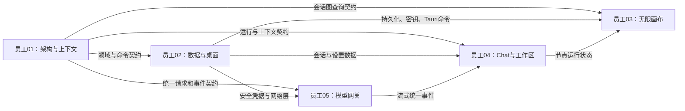

# MindScape V1 前五名员工任务分配方案

> 文档性质：首批五名核心工程人员责任书  
> 版本：V1.0 Draft  
> 日期：2026-08-14  
> 关联主表：[第一版任务拆分与团队分配](v1-work-breakdown.md)  
> 使用说明：当前以员工01～05代称，获得真实姓名和能力信息后替换

## 1. 分配前提

当前没有五名员工的姓名、技术栈和工作经验，因此先按第一版最需要的五个核心工程角色分配：

| 临时编号 | 建议岗位 | 核心使命 |
| --- | --- | --- |
| 员工01 | 技术负责人 / 领域架构师 | 统一契约，保证上下文与会话语义正确 |
| 员工02 | 桌面端与数据负责人 | 保证数据可靠、密钥安全、崩溃可恢复 |
| 员工03 | 无限画布前端负责人 | 把会话图稳定呈现为可操作无限画布 |
| 员工04 | Chat与工作区前端负责人 | 完成从输入到流式、错误、设置的用户闭环 |
| 员工05 | 模型网关负责人 | 统一并真实接入多家模型厂商 |

这五个人共同负责 V1 的技术主骨架。导入适配、接续分析、独立 QA、产品设计和发布工程仍需由后续员工承担。

### “分配多一点”的正确理解

下面给每人分配的是贯穿整个 V1 的**责任任务池**，不是要求同时开工。每人同时进行中的任务最多两个：

- 一个主交付任务。
- 一个评审、联调或阻塞清理任务。

员工可以成为一组任务的最终责任人，并在后续人员到位后下放部分实现，但不能下放最终验收责任。

## 2. 五人协作关系



员工01不负责替其他人写全部代码，但有权阻止违反内核不变量的实现进入主分支。

## 3. 员工01：技术负责人 / 领域架构师

### 岗位使命

让所有团队只实现一套会话图、一套分支语义、一套上下文编译规则和一套运行事件，避免业务逻辑散落到前端、数据库和 Provider 适配器。

### 最终负责范围

- `ARC-001～ARC-015`：全部跨团队契约。
- `CORE-003`：边与关系校验。
- `CORE-005～CORE-007`：深入、发散、换角度规则。
- `CORE-009～CORE-013`：路径解析、上下文编译、排除、预算和快照。
- `CORE-020`：内核测试与不变量验证。

共计 25 个直接责任任务。

### 必须亲自完成或亲自主持

| 优先级 | 任务 | 员工01的实际交付 |
| --- | --- | --- |
| P0-阻断 | ARC-001 | 领域对象定义及对象所有权 |
| P0-阻断 | ARC-003 | 五种边关系和三种用户分支动作语义 |
| P0-阻断 | ARC-004 | ContextSnapshot正式契约 |
| P0-阻断 | ARC-005～007 | 统一模型请求、事件和错误分类 |
| P0-阻断 | ARC-009～010 | 导入双轨与证据引用契约 |
| P0-阻断 | ARC-011～012 | 事件账本及命令/查询边界 |
| P0-核心 | CORE-009 | 从根到当前节点的有效路径算法 |
| P0-核心 | CORE-010 | V1上下文编译器 |
| P0-核心 | CORE-011～013 | 排除说明、预算和冻结快照 |
| P0-质量 | CORE-020 | 内核不变量测试方案和最终验收 |

### 可以后续下放实现，但保留验收权

- ARC-002：ID、版本和时间规则细节。
- ARC-008：删除与幂等命令细节。
- ARC-013：安全威胁模型中的具体攻击用例。
- ARC-014：ADR模板和归档机制。
- CORE-003：图循环与非法关系的具体实现。
- CORE-005～007：三种分支命令处理器实现。

### 阶段安排

#### 阶段0：契约冻结

- 完成 `ARC-001～015`。
- 主持架构走查会。
- 逐一让员工02～05解释自己消费的契约。
- 建立破坏性契约变更的审批机制。

**退出条件**：其他四人不再各自定义 Node、ModelRun、Context、Error 和 Provider 状态。

#### 阶段1：最小纵向Alpha

- 完成 `CORE-003`、`CORE-009`、`CORE-010`、`CORE-013`。
- 与员工02完成上下文快照持久化。
- 与员工05完成统一请求和流式事件联调。
- 与员工04贯通从选中节点发送到模型运行。

**退出条件**：能够还原一次真实回答具体使用了哪些上下文。

#### 阶段2：完整分支与上下文

- 完成 `CORE-005～007`、`CORE-011～012`。
- 审查员工03的三种分支交互是否符合真实语义。
- 审查员工04的上下文查看入口。

**退出条件**：深入、发散、换角度不只是按钮不同，而是实际上下文不同。

#### 阶段3～4：集成与发布

- 完成 `CORE-020`。
- 审查导入组未来提交的原文轨与接续轨对接。
- 负责所有重大数据与上下文缺陷的根因确认。
- 发布前签署“内核不变量通过”。

### 每周必须回答

1. 有没有新的平行领域模型出现？
2. 有没有前端或 Provider 绕过上下文编译器？
3. 每次运行能否重建实际上下文？
4. 派生分析是否仍与原始事实分离？
5. 本周哪个契约变化风险最大？

### 禁止事项

- 不亲自接管所有团队的实现，形成单点瓶颈。
- 不在没有迁移方案时频繁修改契约。
- 不允许用一个巨大前端类型文件代替领域契约。
- 不为了赶进度允许UI直接拼接历史消息调用模型。

## 4. 员工02：桌面端、数据与恢复负责人

### 岗位使命

让 MindScape 在真实桌面环境下可靠保存、正确恢复、安全管理密钥；任何单次模型失败、导入失败或强制退出都不能破坏整个工作区。

### 最终负责范围

- `DATA-001～DATA-019`：全部桌面数据、安全与恢复任务。
- `CORE-001～CORE-002`：会话图加载与节点状态机。
- `CORE-004`：普通继续命令。
- `CORE-014～CORE-017`：运行协调、停止、重试、删除恢复。
- `CORE-019`：稳定查询投影。

共计 27 个直接责任任务。

### 必须亲自完成或亲自主持

| 优先级 | 任务 | 员工02的实际交付 |
| --- | --- | --- |
| P0-阻断 | DATA-002～003 | SQLite事务层和迁移框架 |
| P0-阻断 | DATA-004～005 | 工作区、会话、节点、边、消息存储 |
| P0-核心 | DATA-007～008 | 模型运行、上下文快照和事件账本 |
| P0-安全 | DATA-012～013 | 操作系统安全凭据和Tauri命令边界 |
| P0-恢复 | DATA-014～015 | 启动扫描和强制退出恢复 |
| P0-核心 | CORE-014 | 模型运行协调器具体实现 |
| P0-核心 | CORE-015～016 | 真实停止和幂等重试 |
| P0-质量 | DATA-019 | 数据层事务、迁移、损坏和恢复测试 |

### 可以后续下放实现，但保留验收权

- DATA-001：数据目录和容量展示。
- DATA-006：画布坐标与视口存储。
- DATA-009～011：导入原文件、修订和接续轨表实现。
- DATA-016～018：清理、数据位置和备份细节。
- CORE-001～004：基础会话图命令实现。
- CORE-017、CORE-019：删除命令和查询投影细节。

### 阶段安排

#### 阶段0：数据设计与安全边界

- 与员工01冻结数据库对象映射。
- 完成 `DATA-001～003`、`DATA-012～013` 的方案和技术验证。
- 明确数据库、原始文件和安全凭据的物理位置。
- 建立迁移、事务和备份规则。

**退出条件**：前端不能直接读写数据库文件，API Key不进入普通数据库。

#### 阶段1：最小纵向Alpha

- 完成 `DATA-004～008`。
- 完成 `CORE-001～004`、`CORE-014`。
- 支持真实模型运行事件持续写入。
- 重启后恢复工作区、节点、视口和明确的运行状态。

**退出条件**：不依赖浏览器localStorage也能完成提问、保存和重启恢复。

#### 阶段2：停止、重试与导入底座

- 完成 `CORE-015～017`、`CORE-019`。
- 完成 `DATA-009～011`、`DATA-016～018`。
- 为后续导入组提供原文件与接续轨存储接口。

**退出条件**：停止、失败、重试、删除和备份具有一致事务结果。

#### 阶段3～4：恢复与发布

- 完成 `DATA-014～015`、`DATA-019`。
- 配合QA执行流式崩溃、导入崩溃和迁移失败测试。
- 发布前签署“数据无P0丢失风险”和“密钥无明文泄漏”。

### 每周必须回答

1. 有没有关键数据仍只存在前端内存？
2. 强制关闭后，当前运行会恢复成什么状态？
3. 本周数据库变更有没有迁移和回滚？
4. 日志、数据库或崩溃报告里能否搜到完整Key？
5. 删除操作实际删除了哪些对象和文件？

### 禁止事项

- 不用一个巨大JSON字段保存整个工作区。
- 不让React状态成为正式数据源。
- 不在日志里记录完整请求正文和模型响应。
- 不为了简化开发把Key存入localStorage、环境文件或普通SQLite字段。

## 5. 员工03：无限画布前端负责人

### 岗位使命

将领域会话图准确、流畅、可理解地呈现为无限画布，同时保证画布只是领域状态的投影，不成为另一套业务真相。

### 最终负责范围

- `CAN-001～CAN-020`：全部无限画布前端任务。

共计 20 个直接责任任务。

### 必须亲自完成或亲自主持

| 优先级 | 任务 | 员工03的实际交付 |
| --- | --- | --- |
| P0-阻断 | CAN-001 | 领域查询到渲染器的适配层 |
| P0-核心 | CAN-002～005 | 视口、节点、运行状态和语义边 |
| P0-核心 | CAN-006～008 | 当前节点、拖拽保存、自动创建定位 |
| P0-核心 | CAN-009～011 | 三种分支交互 |
| P0-体验 | CAN-012～014 | 流式稳定、聚焦阅读、视口恢复 |
| P0-性能 | CAN-019 | 200节点性能基准与优化 |
| P0-质量 | CAN-020 | 画布组件与集成测试 |

### 可以后续下放实现，但保留验收权

- CAN-015：小地图或宏观导航。
- CAN-016：删除确认界面。
- CAN-017：画布空白与错误状态。
- CAN-018：键盘和焦点细节。
- CAN-020中的具体组件测试用例。

### 阶段安排

#### 阶段0：画布技术验证

- 与员工01确认 Node、Edge、BranchType 和查询模型。
- 评估正式画布渲染方案，不让库内部对象进入领域契约。
- 建立长文本节点、流式增长和200节点基准场景。
- 配合设计确认节点、边、选择和最低尺寸规范。

**退出条件**：更换渲染器不会要求修改会话图领域模型。

#### 阶段1：最小纵向Alpha

- 完成 `CAN-001～008`。
- 与员工02完成位置和视口持久化。
- 与员工04完成流式节点状态联动。
- 能够从根节点生成并显示真实回答节点。

**退出条件**：创建、移动、刷新和重启后节点内容与关系不乱。

#### 阶段2：完整画布体验

- 完成 `CAN-009～018`。
- 三种分支调用领域命令，不在前端复制上下文。
- 完成聚焦阅读、定位、小地图、删除提示和键盘操作。

**退出条件**：陌生用户能理解当前节点、来源和三种分支。

#### 阶段3～4：性能与发布

- 完成 `CAN-019～020`。
- 配合QA完成200节点、1280×720、窄窗和长文本测试。
- 发布前签署“画布语义投影正确”和“核心性能通过”。

### 每周必须回答

1. 画布状态中有没有领域层不知道的业务数据？
2. 新节点和流式内容是否引发持续布局跳动？
3. 坐标损坏后能否基于语义图重新布局？
4. 200节点当前帧率、内存和交互延迟是多少？
5. 三种边除了颜色之外是否仍能区分？

### 禁止事项

- 不在画布组件中拼模型上下文。
- 不根据节点坐标推断父子或分支关系。
- 不把画布库生成的临时ID当作领域ID。
- 不为了动画效果牺牲节点可读性、状态稳定和低端设备性能。

## 6. 员工04：Chat、工作区与设置前端负责人

### 岗位使命

让用户能够清楚、快速、可靠地完成输入、选择模型、查看流式回答、停止、重试、理解错误和恢复工作，同时不暴露厂商协议和内部复杂度。

### 最终负责范围

- `CHAT-001～CHAT-019`：全部Chat、工作区与模型设置前端任务。

共计 19 个直接责任任务。

### 必须亲自完成或亲自主持

| 优先级 | 任务 | 员工04的实际交付 |
| --- | --- | --- |
| P0-核心 | CHAT-001～005 | 输入、继续位置、模型选择、发送和流式渲染 |
| P0-核心 | CHAT-006～008 | 停止、重试和错误呈现 |
| P0-内容 | CHAT-009～011 | Markdown、复制和上下文查看 |
| P0-工作区 | CHAT-013～015 | 会话侧栏、Provider设置、Key安全交互 |
| P0-体验 | CHAT-016～018 | 首次使用、离线无Key、最低尺寸 |
| P0-质量 | CHAT-019 | Chat完整集成测试 |

### 可以后续下放实现，但保留验收权

- CHAT-009～010：Markdown与复制细节。
- CHAT-012：能力不兼容提示。
- CHAT-013：侧栏和会话列表视觉细节。
- CHAT-016～018：部分空状态与响应式细节。
- CHAT-019中的组件级测试。

### 阶段安排

#### 阶段0：状态与交互契约

- 与设计完成输入、流式、停止、失败、重试状态矩阵。
- 与员工01确认运行、上下文和错误查询模型。
- 与员工05确认只消费统一流式事件。
- 与员工02确认设置、凭据和工作区命令。

**退出条件**：Chat前端不需要知道OpenAI、Claude或Gemini的原始事件格式。

#### 阶段1：最小纵向Alpha

- 完成 `CHAT-001～005`、`CHAT-013～015` 的最小版本。
- 使用员工05的本地模拟Provider先贯通，再切换真实Provider。
- 与员工03完成问题、流式回答和节点状态同步。

**退出条件**：用户可以配置一个真实模型、发送、看到流式回答并重启恢复。

#### 阶段2：完整Chat体验

- 完成 `CHAT-006～012`、`CHAT-016～018`。
- 停止必须真正传播，重试必须清楚且幂等。
- 错误必须根据分类给出可执行解决方案。
- 上下文入口必须展示实际快照，不是模型事后解释。

**退出条件**：密钥、限流、余额、网络、超时和离线具有不同体验。

#### 阶段3～4：集成与发布

- 完成 `CHAT-019`。
- 配合QA完成模型切换、恢复、窄窗、键盘和三分钟首次价值。
- 发布前签署“基础Chat闭环通过”。

### 每周必须回答

1. 用户当前从哪个节点继续是否始终清楚？
2. UI是否只消费统一ModelRunEvent？
3. 停止按钮是真的取消还是只隐藏输出？
4. 错误提示是否告诉用户下一步怎么做？
5. 无Key、离线和真实运行是否可能被误认为演示模式？

### 禁止事项

- 不直接解析某家厂商SSE。
- 不在前端保存明文Key。
- 不把失败响应渲染成普通assistant回答。
- 不在不知道实际ContextSnapshot时生成伪造“参考了哪些内容”。

## 7. 员工05：多厂商模型运行时负责人

### 岗位使命

建立统一、可靠、安全的模型执行层，让OpenAI、Claude、Gemini、DeepSeek和兼容接口成为可替换运行引擎，而不是五套散落在产品中的特殊逻辑。

### 最终负责范围

- `PROV-001～PROV-020`：全部多厂商模型运行时任务。

共计 20 个直接责任任务。

### 必须亲自完成或亲自主持

| 优先级 | 任务 | 员工05的实际交付 |
| --- | --- | --- |
| P0-阻断 | PROV-001～004 | 注册表、统一客户端、能力声明和错误映射 |
| P0-安全 | PROV-005～006 | 配置校验、连接测试和安全请求层 |
| P0-核心 | PROV-007 | 通用SSE与流式解析底座 |
| P0-厂商 | PROV-008～012 | 五类正式Provider适配 |
| P0-可靠性 | PROV-013～015 | 取消、超时和安全重试 |
| P0-审计 | PROV-016～017 | 用量归一化和脱敏日志 |
| P0-测试 | PROV-018～019 | 模拟Provider和真实API契约测试 |

### 可以后续下放实现，但保留验收权

- PROV-008～012：不同厂商适配器的具体实现可分别下放。
- PROV-016：各家用量字段映射。
- PROV-017：日志脱敏具体规则测试。
- PROV-020：新增适配器与支持范围文档。

不能下放或分裂：`PROV-001～007`。它们决定所有适配器共同遵循的运行时基础。

### 阶段安排

#### 阶段0：统一运行时底座

- 完成 `PROV-001～007` 的契约和技术验证。
- 完成 `PROV-018` 本地模拟Provider。
- 与员工01冻结请求、事件和错误。
- 与员工02冻结安全凭据和Tauri网络边界。

**退出条件**：员工04可以在没有任何真实API Key时稳定测试流式、慢响应、断线、取消和错误。

#### 阶段1：单Provider真实Alpha

- 优先完成 `PROV-008` OpenAI适配器，或由管理层指定另一个首发Provider。
- 完成 `PROV-013～017` 的最小正式版本。
- 贯通真实流式、停止、错误、用量和脱敏日志。

**退出条件**：真实模型通过发送、流式、停止、无效Key、超时和重试测试。

#### 阶段2：多Provider并行

- 完成 `PROV-009～012`。
- 每家至少选择一个真实模型建立固定契约测试。
- 厂商差异进入能力声明，不泄漏到Chat组件。

**退出条件**：配置中显示的正式支持厂商全部通过真实API矩阵。

#### 阶段3～4：可靠性与发布

- 完成 `PROV-019～020`。
- 配合QA完成错误矩阵、重复计费风险、网络断开和Key泄漏测试。
- 发布前签署“正式Provider支持矩阵”。

### 每周必须回答

1. 当前哪家是配置存在但真实契约未通过？
2. 取消是否真正关闭网络连接？
3. 哪些错误允许重试，是否可能重复计费？
4. 日志、数据库和异常中能否找到完整Key或正文？
5. 厂商独有能力是否被诚实声明，而不是伪装统一？

### 禁止事项

- 不让适配器直接创建画布节点。
- 不让适配器自己读取历史并选择上下文。
- 不用同一个OpenAI-compatible实现未经测试就宣称支持所有厂商。
- 不吞掉错误后返回一段“模型暂时不可用”的伪回答。

## 8. 五人第一周具体开工单

第一周目标不是做出最多页面，而是冻结契约并让最小纵向链路具备开工条件。

| 员工 | 第一周主任务 | 第一周副任务 | 周末交付 |
| --- | --- | --- | --- |
| 员工01 | ARC-001、003～007、009～012 | ARC-013～015 | 六项核心契约初版与架构走查 |
| 员工02 | DATA-001～003、012～013 | CORE-001～002方案 | 数据、迁移、凭据、Tauri边界验证 |
| 员工03 | CAN-001～002技术验证 | CAN-003、019基准场景 | 渲染器隔离方案与200节点初始基线 |
| 员工04 | CHAT-001～005状态原型 | CHAT-013～015接口梳理 | Chat状态矩阵与模拟流式界面 |
| 员工05 | PROV-001～007 | PROV-018 | 统一运行时底座和模拟Provider |

### 第一周禁止追求

- 五家真实模型同时接完。
- 三种分支全部做完。
- 完整视觉动效。
- 正式导入分析。
- 所有数据库表一次设计完成。

第一周结束时应该得到的是可冻结的契约、可验证的技术底座和明确风险，而不是一个看起来功能很多但无法持久化的Demo。

## 9. 阶段1最小纵向链路分工

```text
员工04：用户输入与模型选择
→ 员工01：上下文快照
→ 员工02：创建并持久化ModelRun
→ 员工05：真实Provider流式事件
→ 员工02：事件与节点状态落库
→ 员工04：流式内容状态呈现
→ 员工03：节点和边在画布中稳定显示
→ 员工02：重启恢复
```

任何一环未完成，都不能把“基础Chat Alpha”标记为完成。

## 10. 交叉评审关系

| 提交人 | 必须评审人 | 重点检查 |
| --- | --- | --- |
| 员工01 | 员工02 + 对应消费方 | 契约是否可持久化、是否可实现 |
| 员工02 | 员工01 | 是否违反领域不变量和命令边界 |
| 员工03 | 员工01 + 员工04 | 语义投影、节点状态、共享交互 |
| 员工04 | 员工01 + 员工05 | 上下文真实性、统一事件消费 |
| 员工05 | 员工01 + 员工02 | 运行契约、安全凭据、错误和取消 |

后续QA负责人加入后，数据恢复、Provider契约和发布阻断功能必须增加QA评审。

## 11. 工作量与人员补充判断

| 员工 | 责任任务数 | 主要压力 | 最优先补充的协作者 |
| --- | ---: | --- | --- |
| 员工01 | 25 | 契约评审与上下文内核 | 领域后端工程师 |
| 员工02 | 27 | 数据、恢复和运行协调 | Rust / SQLite工程师 |
| 员工03 | 20 | 画布交互与性能 | 画布前端工程师 |
| 员工04 | 19 | Chat状态与设置体验 | React前端工程师 |
| 员工05 | 20 | 多厂商适配与协议测试 | Provider后端工程师 |

共分配111个直接责任任务。五人可以启动和建立主骨架，但不建议五个人独立完成全部V1。后续员工优先补入：

1. 导入负责人。
2. AI接续分析负责人。
3. 两名QA。
4. 产品设计。
5. 发布工程。
6. 分别支援员工01～05的实现工程师。

## 12. 绩效与完成判断

### 员工01

不以写了多少代码评价，而以契约稳定度、跨组返工次数、上下文正确性和重大架构风险为准。

### 员工02

以数据一致性、迁移成功、强制退出恢复、密钥安全和运行状态可靠性为准。

### 员工03

以语义投影正确、交互可理解、流式布局稳定、200节点性能和画布恢复为准。

### 员工04

以首次真实提问成功、状态反馈完整、停止重试真实、错误可解决和上下文可查看为准。

### 员工05

以正式Provider真实契约通过率、错误归类、取消传播、无重复计费风险和无密钥泄漏为准。

所有员工都不以提交数、代码行数和页面完成百分比作为核心评价。

## 13. 总经理管理方式

### 每日只跟踪

- 当前主任务ID。
- 当前阻塞任务ID。
- 需要谁提供什么契约或交付物。
- 是否违反WIP最多两个的规则。

### 每周五人联调会

只演示一条真实链路，不分别汇报页面：

1. 用户做了什么。
2. 内核创建了什么状态。
3. 实际发送了什么上下文。
4. Provider返回了什么事件。
5. 数据如何保存和恢复。
6. 画布与Chat如何呈现同一状态。

### 红线

- 不允许“我的模块完成了，但别人接不上”。
- 不允许用模拟成功代替真实错误处理。
- 不允许绕过领域契约赶页面进度。
- 不允许无迁移地修改数据库。
- 不允许没有真实测试就宣称支持某厂商。

## 14. 待替换人员信息

拿到真实员工资料后，应补充：

| 临时编号 | 真实姓名 | 主要技术栈 | 年限/等级 | 每周投入 | 是否带人 |
| --- | --- | --- | --- | ---: | --- |
| 员工01 |  |  |  |  |  |
| 员工02 |  |  |  |  |  |
| 员工03 |  |  |  |  |  |
| 员工04 |  |  |  |  |  |
| 员工05 |  |  |  |  |  |

如果真实能力与假设不符，调整角色和任务所有权，不强迫员工适应临时编号。
