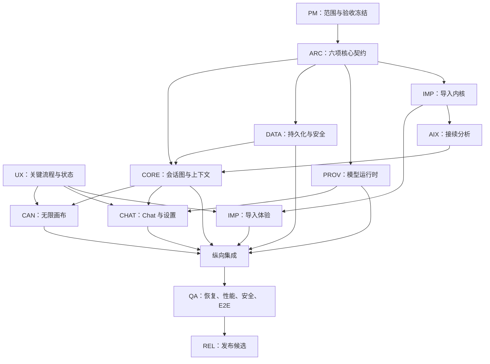

# MindScape 第一版任务拆分与团队分配方案

> 文档性质：V1 执行主计划 / Work Breakdown Structure  
> 版本：V1.0 Draft  
> 日期：2026-08-14  
> 上位文档：[第一版产品范围](v1-product-scope.md) · [产品内核与工程总览](core-kernel-overview.md)  
> 适用对象：总经理、产品负责人、技术负责人、各组负责人、工程师与 QA

## 1. 管理结论

第一版不能分成“画布做完、Chat 做完、导入做完、模型接口做完”四个互不相关的项目。它们共同依赖同一个会话图、上下文快照、模型运行和本地数据内核。

正确执行方式是：

1. 先冻结跨团队契约。
2. 尽快贯通一个最小纵向闭环。
3. 各专业组再并行扩展完整能力。
4. 最后围绕真实用户流程集成，而不是围绕页面数量集成。

建议将 V1 划分为 12 个工作流：

| 工作流 | 主要成果 | 推荐负责人 |
| --- | --- | --- |
| PM | 范围、排期、风险、验收 | 产品负责人 |
| UX | 完整交互与设计规范 | 设计负责人 |
| ARC | 领域与跨团队契约 | 技术负责人 |
| CORE | 会话图与上下文内核 | 领域后端负责人 |
| DATA | Tauri、本地数据与安全 | 桌面端负责人 |
| CAN | 无限画布 | 画布前端负责人 |
| CHAT | 基础 Chat 与状态呈现 | Chat 前端负责人 |
| PROV | 多厂商模型运行时 | 模型网关负责人 |
| IMP | 外部会话导入 | 导入负责人 |
| AIX | 快速与详细接续分析 | AI 工程负责人 |
| QA | 测试、性能、安全与恢复 | QA 负责人 |
| REL | 构建、签名、发布与支持 | 发布负责人 |

## 2. 如何使用这份任务表

### 工作量标记

- **S**：1–2 个理想工程日。
- **M**：3–5 个理想工程日。
- **L**：6–8 个理想工程日，必须设置评审点。

超过 L 的工作不允许直接分配给个人，应继续拆分。

### 负责人规则

- 每项任务只有一个直接负责人。
- 可以有协作者和评审人，但不能出现“前后端共同负责”。
- 跨组契约由技术负责人批准，不能由任一消费方单独修改。
- 负责人对交付结果负责，不只对代码提交负责。

### 统一完成标准 Definition of Done

除任务自身标准外，所有工程任务都必须同时满足：

1. 使用正式领域契约，不建立未登记的平行数据结构。
2. 包含成功、空状态、失败、中断、重试或恢复场景。
3. 包含与风险相称的自动化测试。
4. 不泄漏 API Key、完整私人内容或敏感日志。
5. 关键行为具有可观察的错误和状态，不静默失败。
6. 接口或数据格式变更同步更新契约与文档。
7. 通过负责人自测、同组评审和 QA 验收。

现有演示原型只能作为交互参考。除非按上述标准重新验收，否则不能把原型中出现过的功能标记为完成。

## 3. 推荐团队配置

### 理想配置：17–19 人

| 角色 | 人数 | 主要责任 |
| --- | ---: | --- |
| 总经理 / 产品负责人 | 1 | 决策、范围、优先级、验收 |
| 产品经理 | 1 | 流程、需求、任务协调 |
| 产品设计师 | 2 | 画布、Chat、导入、设置、状态设计 |
| 技术负责人 / 架构师 | 1 | 契约、架构评审、跨组集成 |
| 领域 / 桌面 / 数据工程师 | 3 | Tauri、SQLite、事件、会话图、恢复 |
| 画布前端工程师 | 3 | 无限画布、节点、边、交互、性能 |
| Chat / 设置前端工程师 | 2 | 输入、流式、错误、模型配置、引导 |
| Provider 后端工程师 | 2 | 多厂商适配、流式、取消、错误、用量 |
| 导入 / AI 工程师 | 2 | 平台适配、接续轨、引用、分析评测 |
| QA 工程师 | 2–3 | 自动化、端到端、性能、安全、恢复 |
| 发布工程师 | 1，可兼职 | CI、签名、安装包、升级、回滚 |

### 精简配置：10–12 人

- 技术负责人兼领域负责人。
- 数据与 Provider 合并为后端组。
- Chat 与工作区设置合并。
- 导入解析与 AI 接续分析合并。
- QA 至少保留 2 人，不建议完全由开发兼任。

人数增加不应改变依赖顺序。最容易通过加人并行的部分是画布交互、不同 Provider 适配器、不同导入适配器和测试样本建设；最不适合多人同时修改的是领域契约、上下文编译器和数据库迁移。

## 4. 总依赖关系



### 真正的关键路径

```text
范围冻结
→ 领域 / 流式 / 导入契约
→ 本地存储与会话图
→ 上下文快照
→ 单模型真实流式 Chat
→ 分支继续
→ 崩溃恢复
→ 端到端验收
```

多模型数量和专用导入适配器可以并行，但不能替代这条关键路径。

## 5. PM：产品管理与项目治理

| ID | 任务 | 交付物与完成标准 | 依赖 | 大小 |
| --- | --- | --- | --- | --- |
| PM-001 | 任命各工作流负责人 | 每条工作流有唯一负责人、评审人和替补 | 无 | S |
| PM-002 | 冻结 V1 P0 / P1 / 不做清单 | 全员确认，以范围文档为唯一基线 | 无 | S |
| PM-003 | 建立范围变更流程 | 新功能必须说明替换项、周期、依赖和风险 | PM-002 | S |
| PM-004 | 建立主任务看板 | 所有任务带 ID、负责人、依赖、状态和目标版本 | PM-001 | S |
| PM-005 | 确定目标平台 | 明确 Windows 最低版本及 macOS 是否进入承诺 | 无 | S |
| PM-006 | 确定 BYOK 与商业边界 | 明确 V1 是否只有 BYOK、费用归属和免责声明 | 无 | S |
| PM-007 | 确定内测计划 | Alpha、Beta 人数、用户类型、反馈渠道和保密范围 | PM-002 | M |
| PM-008 | 建立周度风险会议 | 每周审查关键路径、阻塞、数据风险和范围变化 | PM-004 | S |
| PM-009 | 建立发布验收表 | 将 V1 十项用户流程转成签字验收清单 | PM-002 | M |
| PM-010 | 建立决策记录制度 | 关键技术与产品决策有负责人、日期和取代关系 | PM-003 | S |

## 6. UX：产品流程与设计交付

| ID | 任务 | 交付物与完成标准 | 依赖 | 大小 |
| --- | --- | --- | --- | --- |
| UX-001 | 第一版信息架构 | 工作区、会话、画布、导入和设置导航图 | PM-002 | M |
| UX-002 | 首次使用流程 | 从首次打开到第一次真实回答或导入的完整原型 | UX-001 | M |
| UX-003 | 根会话流程 | 空白画布、输入、选择模型、生成根节点的状态图 | UX-001 | M |
| UX-004 | 节点视觉规范 | 问题、回答、模型、状态、来源、操作和尺寸规则 | ARC-001 | M |
| UX-005 | 分支交互规范 | 深入、发散、换角度的入口、反馈和解释 | UX-004 | M |
| UX-006 | 聚焦阅读规范 | 进入、阅读、复制、返回原视口和响应状态 | UX-004 | S |
| UX-007 | 导入完整流程 | 选文件、预览、完整度、分析档位、结果和失败 | UX-001 | L |
| UX-008 | 模型配置流程 | 添加、验证、编辑、禁用、删除和密钥说明 | PM-006 | M |
| UX-009 | Chat 状态矩阵 | 空闲、发送、流式、停止、失败、重试、离线 | UX-003 | M |
| UX-010 | 错误文案体系 | 密钥、限流、余额、网络、格式、数据和恢复文案 | PROV-004, IMP-004 | M |
| UX-011 | 删除与破坏性操作 | 节点、分支、会话、原文件和分析层确认规则 | ARC-008 | M |
| UX-012 | 空状态与渐进引导 | 无会话、无模型、无密钥、无导入、第一次分支 | UX-002 | M |
| UX-013 | 1280×720 与窄窗规范 | 最低尺寸、折叠、溢出和关键操作优先级 | UX-004 | M |
| UX-014 | 键盘与可访问性规范 | 焦点、快捷键、按钮名称、对比度和非颜色状态 | UX-004 | M |
| UX-015 | 可用性测试 | 5–8 名目标用户完成首次提问和导入，形成问题表 | UX-002, UX-007 | M |

## 7. ARC：架构与跨团队契约

这一组任务必须优先完成。契约冻结前，各组可以做交互和技术验证，但不能大规模进入正式实现。

| ID | 任务 | 交付物与完成标准 | 依赖 | 大小 |
| --- | --- | --- | --- | --- |
| ARC-001 | 冻结领域对象 | Workspace、Conversation、Node、Edge、Message、ContentBlock | PM-002 | M |
| ARC-002 | 冻结 ID、版本和时间规则 | 全局 ID、修订号、时间、软删除和来源标识统一 | ARC-001 | S |
| ARC-003 | 冻结分支语义 | continues、deepens、diverges、reframes、imported_from | ARC-001 | S |
| ARC-004 | 冻结上下文快照契约 | 输入、引用、排除项、协议版本、Token 估算 | ARC-001 | M |
| ARC-005 | 冻结统一模型请求 | ModelRunRequest、能力声明、预算、取消和超时 | ARC-004 | M |
| ARC-006 | 冻结统一流式事件 | started、text_delta、usage、completed、cancelled、failed | ARC-005 | M |
| ARC-007 | 冻结 Provider 错误分类 | 鉴权、限流、余额、模型、网络、超时、内容策略、未知 | ARC-005 | M |
| ARC-008 | 冻结命令与删除语义 | 创建、连接、移动、删除、恢复、级联和幂等规则 | ARC-001 | M |
| ARC-009 | 冻结导入领域契约 | ImportSource、Revision、ParseReport、RawTrack、Continuation | ARC-001 | M |
| ARC-010 | 冻结证据引用契约 | 引用回到文件、消息、内容块和工具记录的位置 | ARC-009 | M |
| ARC-011 | 冻结事件账本契约 | 需要记录的领域事件、顺序、事务和回放边界 | ARC-001 | M |
| ARC-012 | 冻结应用命令 / 查询边界 | UI、领域服务、适配器、数据库之间的调用方向 | ARC-001 | M |
| ARC-013 | 完成安全威胁模型 | 密钥、导入注入、日志、文件路径、删除和网络边界 | PM-006, ARC-009 | M |
| ARC-014 | 建立 ADR 模板 | 破坏性契约修改必须记录方案、迁移和回滚 | PM-010 | S |
| ARC-015 | 架构走查会 | 所有负责人能解释内核不变量和自己的禁止事项 | ARC-001~014 | S |

## 8. CORE：会话图与上下文内核

| ID | 任务 | 交付物与完成标准 | 依赖 | 大小 |
| --- | --- | --- | --- | --- |
| CORE-001 | 会话图创建与加载 | 可创建空图并从数据层完整恢复 | ARC-001, DATA-004 | M |
| CORE-002 | 节点创建状态机 | pending、streaming、completed、cancelled、failed 状态合法 | ARC-001, ARC-006 | M |
| CORE-003 | 边与关系校验 | 禁止非法父子、循环和无意义重复关系 | ARC-003 | M |
| CORE-004 | 普通继续规则 | 从当前节点建立 continues 子节点 | CORE-002, CORE-003 | S |
| CORE-005 | 深入分支规则 | 正确继承当前路径和工作结论 | ARC-003, ARC-004 | M |
| CORE-006 | 发散分支规则 | 继承背景与约束，排除不必要结论 | ARC-003, ARC-004 | M |
| CORE-007 | 换角度分支规则 | 回到上游问题，显式排除当前回答为既定事实 | ARC-003, ARC-004 | M |
| CORE-008 | 当前节点与选择模型 | 统一维护当前继续位置，不依赖画布库选择状态 | ARC-012 | S |
| CORE-009 | 路径解析器 | 从根到当前节点生成有效语义路径 | CORE-003 | M |
| CORE-010 | 上下文编译器 V1 | 组合当前输入、路径、约束、导入来源和协议 | ARC-004, CORE-009 | L |
| CORE-011 | 上下文排除与说明 | 记录未采用的当前回答、低相关历史和排除原因 | CORE-010 | M |
| CORE-012 | Token 估算与预算 | 编译前估算，超预算给出裁剪或提示 | CORE-010 | M |
| CORE-013 | 上下文快照冻结 | 每次运行不可变保存实际引用和版本 | CORE-010, DATA-007 | M |
| CORE-014 | 模型运行协调器 | 创建 Run、转发事件、更新节点、结束事务 | ARC-005, ARC-006, DATA-007 | L |
| CORE-015 | 停止与取消状态 | 用户停止后保留已生成内容，状态可恢复 | CORE-014 | M |
| CORE-016 | 幂等重试 | 重试生成新修订或新节点，不静默复制 | CORE-014, ARC-008 | M |
| CORE-017 | 删除与恢复命令 | 节点、后代和边符合确认与软删除规则 | ARC-008, DATA-011 | M |
| CORE-018 | 导入来源接入 | 原文轨或接续轨能进入上下文编译器 | ARC-009, AIX-008 | M |
| CORE-019 | 查询投影 | 为画布、Chat、导入状态提供稳定查询模型 | ARC-012 | M |
| CORE-020 | 内核单元与属性测试 | 覆盖循环、断边、并发运行、重试和恢复不变量 | CORE-001~019 | L |

## 9. DATA：Tauri、本地数据、安全与恢复

| ID | 任务 | 交付物与完成标准 | 依赖 | 大小 |
| --- | --- | --- | --- | --- |
| DATA-001 | 确定本地数据目录 | 各平台路径、权限、容量和用户可见说明 | PM-005 | S |
| DATA-002 | SQLite 连接与事务层 | 连接池、事务、外键、日志脱敏和错误包装 | ARC-012 | M |
| DATA-003 | 数据库迁移框架 | 版本、升级、失败回滚和迁移测试 | DATA-002 | M |
| DATA-004 | 工作区与会话表 | CRUD、最近会话、软删除和索引 | ARC-001, DATA-003 | M |
| DATA-005 | 节点、边与消息存储 | 关系完整、内容块、修订和查询索引 | ARC-001, DATA-003 | L |
| DATA-006 | 画布视图状态存储 | 坐标、缩放和视口与语义数据分离 | DATA-005 | S |
| DATA-007 | 模型运行与事件存储 | Run、流式状态、错误、用量和上下文快照 | ARC-004, ARC-006, DATA-003 | L |
| DATA-008 | 事件账本存储 | 顺序、事务、幂等键和回放查询 | ARC-011, DATA-003 | M |
| DATA-009 | 原始导入文件存储 | 内容指纹、路径安全、元数据和不可变保存 | ARC-009, DATA-001 | M |
| DATA-010 | 导入修订与解析报告 | 多次导入、重复、适配器版本和异常记录 | ARC-009, DATA-003 | M |
| DATA-011 | 接续轨与证据存储 | 派生版本、引用、失效、修正和删除 | ARC-010, DATA-003 | M |
| DATA-012 | 操作系统安全凭据 | 新增、读取、更新、删除 Key；数据库只存引用 | ARC-013 | L |
| DATA-013 | Tauri 命令边界 | 前端只能通过稳定命令访问文件、数据和密钥 | ARC-012 | M |
| DATA-014 | 启动恢复扫描 | 识别未完成模型运行、导入事务和迁移状态 | DATA-007, DATA-010 | M |
| DATA-015 | 强制退出恢复 | 中断流式和导入后重启，数据保持一致 | DATA-014 | M |
| DATA-016 | 删除与清理实现 | 会话、原文件、派生层、凭据分别清理并可说明 | ARC-008, DATA-009~012 | M |
| DATA-017 | 数据位置与隐私查询 | UI 可展示数据目录、大小和删除范围 | DATA-001, DATA-016 | S |
| DATA-018 | 备份与恢复底座 | 发布前可做数据库备份、迁移失败自动保留副本 | DATA-003 | M |
| DATA-019 | 数据层测试套件 | 事务、并发、迁移、损坏、路径和删除测试 | DATA-002~018 | L |

## 10. CAN：无限画布前端

| ID | 任务 | 交付物与完成标准 | 依赖 | 大小 |
| --- | --- | --- | --- | --- |
| CAN-001 | 画布领域适配层 | 将查询投影映射到渲染器，不泄漏库对象到内核 | ARC-012, CORE-019 | M |
| CAN-002 | 基础无限视口 | 平移、缩放、边界、背景和空画布 | UX-003 | M |
| CAN-003 | 会话节点组件 | 问题、回答、模型、时间、状态、来源和操作区 | UX-004, CORE-002 | L |
| CAN-004 | 节点状态视觉 | pending、streaming、failed、cancelled、selected 清楚区分 | UX-009 | M |
| CAN-005 | 语义边组件 | 不同关系可辨认，不只依赖颜色 | UX-005, ARC-003 | M |
| CAN-006 | 当前节点选择 | 点选、取消、输入区联动和焦点状态 | CORE-008 | M |
| CAN-007 | 节点拖拽与位置保存 | 拖动流畅、节流保存、重启恢复 | DATA-006 | M |
| CAN-008 | 自动创建与定位 | 新节点出现后合理布局并定位，不覆盖原节点 | CORE-004 | M |
| CAN-009 | 深入分支交互 | 发出 deepens 意图并显示创建过程 | UX-005, CORE-005 | S |
| CAN-010 | 发散分支交互 | 发出 diverges 意图并显示创建过程 | UX-005, CORE-006 | S |
| CAN-011 | 换角度分支交互 | 发出 reframes 意图并提示上下文差异 | UX-005, CORE-007 | S |
| CAN-012 | 流式内容稳定布局 | 输出增长不引发整个画布持续跳动 | CAN-003, CHAT-005 | M |
| CAN-013 | 聚焦阅读 | 打开、阅读、复制、关闭并回到原视口 | UX-006 | M |
| CAN-014 | 适配全部节点 | fit view、定位当前节点和恢复上次视口 | DATA-006 | S |
| CAN-015 | 小地图或宏观导航 | 200 节点时仍能快速定位；不阻塞主操作 | CAN-002 | M |
| CAN-016 | 删除确认与后代提示 | 明确影响范围，按领域命令执行 | UX-011, CORE-017 | M |
| CAN-017 | 画布加载与错误状态 | 加载、空白、损坏节点和恢复入口 | UX-012 | S |
| CAN-018 | 键盘操作与焦点 | 选择、移动视口、删除、返回阅读可使用键盘 | UX-014 | M |
| CAN-019 | 200 节点性能优化 | 建立基准，避免持续明显掉帧和内存失控 | CAN-001~018 | L |
| CAN-020 | 画布组件与集成测试 | 节点、边、拖拽、分支、恢复和缩放回归 | CAN-001~019 | L |

## 11. CHAT：基础 Chat、工作区与模型设置前端

| ID | 任务 | 交付物与完成标准 | 依赖 | 大小 |
| --- | --- | --- | --- | --- |
| CHAT-001 | 多行输入框 | Enter 发送、Shift+Enter 换行、禁用和焦点规则 | UX-003 | S |
| CHAT-002 | 从根或节点继续提示 | 清楚显示当前从哪里继续，可取消选择 | CORE-008 | M |
| CHAT-003 | 模型选择器 | 只影响下一次运行，显示厂商、模型与可用状态 | PROV-003 | M |
| CHAT-004 | 发送与乐观状态 | 立即出现问题和等待状态，失败可恢复 | CORE-014 | M |
| CHAT-005 | 统一流式渲染 | 消费 text_delta，不解析厂商原始事件 | ARC-006, CORE-014 | M |
| CHAT-006 | 停止生成 | 立即反馈，保留已有输出并同步最终状态 | CORE-015, PROV-012 | M |
| CHAT-007 | 重试回答 | 用户理解重试对象，不产生静默重复 | CORE-016 | M |
| CHAT-008 | 错误呈现 | 按错误分类给出可操作建议，不展示原始敏感响应 | ARC-007, UX-010 | M |
| CHAT-009 | Markdown 与代码显示 | 标题、列表、链接、引用、代码块稳定安全渲染 | UX-004 | M |
| CHAT-010 | 复制回答 | 复制纯文本或 Markdown，明确成功状态 | CHAT-009 | S |
| CHAT-011 | 上下文查看入口 | 显示本轮引用了哪些路径、导入消息和排除项 | CORE-013 | M |
| CHAT-012 | 能力不兼容提示 | 模型不支持输入能力时发送前提示 | PROV-003 | S |
| CHAT-013 | 工作区侧栏 | 新建、最近、打开、重命名和删除会话 | DATA-004, UX-001 | M |
| CHAT-014 | 模型配置列表 | 查看、添加、编辑、禁用、删除和测试连接 | UX-008, PROV-005, DATA-012 | L |
| CHAT-015 | API Key 安全交互 | 密钥不回显、可替换、可删除、说明保存位置 | DATA-012, UX-008 | M |
| CHAT-016 | 首次使用空状态 | 提问或导入两个直接入口，不使用多页教程 | UX-002, UX-012 | M |
| CHAT-017 | 离线与无密钥状态 | 演示与真实模式不混淆，提供明确解决路径 | UX-012 | S |
| CHAT-018 | 最低尺寸与窄窗适配 | 1280×720 完整，窄窗保留核心操作 | UX-013 | M |
| CHAT-019 | Chat 集成测试 | 发送、流式、停止、错误、重试、切换模型 | CHAT-001~018 | L |

## 12. PROV：多厂商模型运行时

| ID | 任务 | 交付物与完成标准 | 依赖 | 大小 |
| --- | --- | --- | --- | --- |
| PROV-001 | Provider 注册表 | 厂商、模型、能力、默认地址和配置模式 | ARC-005 | M |
| PROV-002 | 统一请求客户端 | 接收 ModelRunRequest 并选择适配器 | ARC-005 | M |
| PROV-003 | 能力声明 | 文本、视觉、工具、上下文限制和流式能力可查询 | PROV-001 | M |
| PROV-004 | 错误映射规范 | 厂商错误统一映射并保留脱敏诊断信息 | ARC-007 | M |
| PROV-005 | 配置校验与连接测试 | Base URL、Key、模型 ID 在保存前可验证 | PROV-001, DATA-012 | M |
| PROV-006 | 安全网络请求层 | 由 Tauri / 受控后端请求，处理代理和证书错误 | ARC-013, DATA-013 | L |
| PROV-007 | SSE / 流式解析底座 | 分片、心跳、半包、结束和异常均正确处理 | ARC-006 | L |
| PROV-008 | OpenAI 适配器 | 真实文本流式、停止、错误、用量测试通过 | PROV-002, PROV-007 | M |
| PROV-009 | Anthropic 适配器 | 同上，正确处理系统消息与事件格式 | PROV-002, PROV-007 | M |
| PROV-010 | Gemini 适配器 | 同上，正确处理角色与内容结构 | PROV-002, PROV-007 | M |
| PROV-011 | DeepSeek 适配配置 | 真实模型测试，不仅复用名称 | PROV-008 | S |
| PROV-012 | OpenAI-compatible / OpenRouter | 自定义 Base URL、Header 差异和模型配置 | PROV-008 | M |
| PROV-013 | 取消传播 | 从 UI 到网络连接真正取消，不只隐藏输出 | PROV-006, PROV-007 | M |
| PROV-014 | 超时策略 | 连接、首 Token、流式空闲和总时长分别处理 | PROV-006 | M |
| PROV-015 | 安全重试策略 | 只重试可恢复错误，避免重复计费和无限循环 | PROV-004, PROV-014 | M |
| PROV-016 | 用量归一化 | 可用时记录输入、输出、缓存和厂商原始用量 | ARC-006 | M |
| PROV-017 | 脱敏日志 | 不记录完整 Key、请求正文和私人会话 | ARC-013 | S |
| PROV-018 | 本地模拟 Provider | 可重复测试流式、慢响应、错误、断线和取消 | ARC-006 | M |
| PROV-019 | 真实 API 契约测试 | 每家至少一个模型通过发布矩阵 | PROV-008~012 | L |
| PROV-020 | Provider 运行文档 | 支持范围、限制、错误和新增适配器流程 | PROV-001~019 | S |

不同适配器可以分给不同工程师，但 `PROV-001` 至 `PROV-007` 必须由网关负责人统一控制。

## 13. IMP：外部会话导入器

| ID | 任务 | 交付物与完成标准 | 依赖 | 大小 |
| --- | --- | --- | --- | --- |
| IMP-001 | 建立真实样本库 | ChatGPT、Claude、Codex、通用格式和损坏样本 | PM-007 | M |
| IMP-002 | 导入入口 | 文件选择、拖放、粘贴和取消 | UX-007, DATA-013 | M |
| IMP-003 | 文件大小与类型预检 | 发送前本地判断格式、大小、编码和风险 | ARC-013 | M |
| IMP-004 | 格式识别器 | 基于内容和扩展名识别，输出置信和候选适配器 | ARC-009 | M |
| IMP-005 | 原文件保存与指纹 | 先可靠保存，再解析；相同内容可识别 | DATA-009 | M |
| IMP-006 | Markdown / TXT 适配器 | 角色标记、段落和退化为单消息规则明确 | IMP-004 | M |
| IMP-007 | 通用 JSON / JSONL 适配器 | 常见消息数组、角色、内容块和异常行 | IMP-004 | M |
| IMP-008 | ChatGPT 专用适配器 | 基于真实导出样本恢复消息与分支 | IMP-001, ARC-009 | L |
| IMP-009 | Claude 专用适配器 | 基于真实导出样本恢复消息与附件信息 | IMP-001, ARC-009 | L |
| IMP-010 | Codex 专用适配器 | 保留命令、工具、文件与执行状态，不压成纯文本 | IMP-001, ARC-009 | L |
| IMP-011 | 统一内容块映射 | 文本、代码、附件、工具和未知扩展可保留 | ARC-009 | M |
| IMP-012 | 顺序、时间和角色校验 | 不颠倒消息，不把 system / tool 误作用户 | IMP-006~010 | M |
| IMP-013 | 分支与父消息恢复 | 可恢复时建立边，不能恢复时明确报告 | ARC-003, IMP-008~010 | M |
| IMP-014 | 附件与缺失引用报告 | 附件存在、缺失、不可读均有状态 | IMP-011 | M |
| IMP-015 | 工具调用安全隔离 | 历史命令和工具请求只作为数据，不执行 | ARC-013, IMP-010 | M |
| IMP-016 | 完整性报告生成 | 统计消息、附件、分支、警告、缺失和恢复级别 | ARC-009, IMP-012~015 | M |
| IMP-017 | 导入预览界面 | 用户在写入会话图前理解范围和异常 | UX-007, IMP-016 | L |
| IMP-018 | 分析档位选择 | 原样、快速、详细的范围、费用和发送边界 | UX-007 | M |
| IMP-019 | 原样继续 | 不调用生成式分析，创建可继续的导入入口 | IMP-016, CORE-018 | M |
| IMP-020 | 解析失败降级 | 保留原文件，可切换纯文本或其他适配器 | IMP-005, IMP-016 | M |
| IMP-021 | 重复与修订处理 | 重复提示、同源新版本和取消导入规则 | DATA-010 | M |
| IMP-022 | 删除导入数据 | 分开处理会话图、原文件和分析层 | UX-011, DATA-016 | M |
| IMP-023 | 导入回归测试 | 每个适配器固定样本、损坏样本和大文件测试 | IMP-001~022 | L |

## 14. AIX：快速识别与详细接续分析

| ID | 任务 | 交付物与完成标准 | 依赖 | 大小 |
| --- | --- | --- | --- | --- |
| AIX-001 | 接续轨结构 | 目标、进展、约束、决策、问题、下一步和引用 | ARC-009, ARC-010 | M |
| AIX-002 | 分析范围生成 | 明确将发送哪些消息、附件和工具内容 | IMP-016, ARC-013 | M |
| AIX-003 | 成本与范围预览 | 分析前显示预计 Token、范围、模型和隐私边界 | AIX-002, PROV-016 | M |
| AIX-004 | 快速识别流程 | 只提取接续必需信息，结构稳定且低成本 | AIX-001, AIX-002 | L |
| AIX-005 | 详细分析流程 | 分阶段处理长会话，提取脉络、分歧、工具和成果 | AIX-001, AIX-002 | L |
| AIX-006 | 证据引用解析 | 每项重要结论回到原消息或内容块 | ARC-010, AIX-004~005 | L |
| AIX-007 | 推断与事实区分 | 用户明确、系统推断、冲突和未知分开 | AIX-001 | M |
| AIX-008 | 接续轨版本管理 | 生成、保存、修正、删除、失效和重新生成 | DATA-011 | M |
| AIX-009 | 分析失败降级 | 分析失败仍可原样继续，不破坏导入结果 | IMP-019, AIX-008 | M |
| AIX-010 | 注入与恶意指令防护 | 导入内容不改变系统边界、不触发工具执行 | ARC-013, IMP-015 | M |
| AIX-011 | 长会话分段策略 | 保持顺序、阶段和引用，不无差别截断 | AIX-005 | M |
| AIX-012 | 接续质量评测集 | 至少覆盖短、长、目标变化、冲突、工具与缺失 | IMP-001 | L |
| AIX-013 | 原样 / 快速 / 详细对比 | 比较遗漏、引用、Token、延迟和可继续性 | AIX-004~012 | M |
| AIX-014 | 上下文编译器对接 | 原文轨与接续轨都可生成冻结快照 | CORE-018, AIX-008 | M |

第一版不为快速和详细分析各建一套互不兼容的数据模型，两者只是在分析范围和深度上不同。

## 15. QA：测试、性能、安全与用户验收

QA 从阶段 0 开始参与，不在开发结束后才进入。

| ID | 任务 | 交付物与完成标准 | 依赖 | 大小 |
| --- | --- | --- | --- | --- |
| QA-001 | V1 总测试策略 | 单元、契约、集成、E2E、性能、安全、恢复矩阵 | PM-009, ARC-015 | M |
| QA-002 | 测试数据管理 | 合成数据、真实脱敏样本、密钥和删除策略 | ARC-013, IMP-001 | M |
| QA-003 | 领域契约测试 | ID、状态、边、快照、事件和迁移兼容 | ARC-001~012 | M |
| QA-004 | 新建会话 E2E | 配模型、提问、流式、保存、重开 | 核心纵向闭环 | M |
| QA-005 | 三种分支 E2E | 关系、上下文继承和视图恢复正确 | CORE-005~007, CAN-009~011 | M |
| QA-006 | 模型切换 E2E | 新运行使用新模型，旧节点不改写 | CHAT-003, PROV-019 | M |
| QA-007 | 原样导入 E2E | 无分析费用、原文完整、可继续 | IMP-019 | M |
| QA-008 | 快速分析 E2E | 接续轨、引用、删除与回退 | AIX-004, AIX-006, AIX-008 | M |
| QA-009 | 详细分析 E2E | 长会话、分段、工具和冲突信息 | AIX-005, AIX-011 | M |
| QA-010 | Provider 错误矩阵 | 密钥、限流、余额、模型、网络、超时、策略 | PROV-019 | L |
| QA-011 | 停止与重试测试 | 取消真正传播，重试不重复计费或复制节点 | CORE-015~016, PROV-013~015 | M |
| QA-012 | 流式崩溃恢复 | 强制关闭后恢复为明确的中断状态 | DATA-014~015 | M |
| QA-013 | 导入崩溃恢复 | 写入中断不产生半个不可打开工作区 | DATA-014~015, IMP-005 | M |
| QA-014 | 数据库迁移失败 | 自动保留副本并能回到可启动状态 | DATA-003, DATA-018 | M |
| QA-015 | 破坏性删除测试 | 节点、后代、会话、原文件、分析层和 Key | DATA-016, IMP-022 | M |
| QA-016 | 200 节点性能基准 | 平移、缩放、选择、流式和内存指标 | CAN-019 | L |
| QA-017 | 启动与打开性能 | 冷启动、普通会话加载和恢复指标 | DATA-014, CHAT-013 | M |
| QA-018 | 最低尺寸测试 | 1280×720、窄窗、缩放和长文本 | CAN-018, CHAT-018 | M |
| QA-019 | 可访问性检查 | 键盘、焦点、名称、对比度和非颜色状态 | UX-014, CAN-018 | M |
| QA-020 | 密钥与日志安全测试 | 搜索安装目录、数据库、日志、崩溃报告和导出 | DATA-012, PROV-017 | M |
| QA-021 | 导入安全测试 | 路径、超大文件、恶意 JSON、提示注入和历史命令 | ARC-013, AIX-010 | L |
| QA-022 | 三分钟首次价值测试 | 陌生用户独立完成首次真实提问或导入 | UX-015, CHAT-016 | M |
| QA-023 | 七日内部稳定性测试 | 内部成员连续使用，记录丢失、崩溃和阻塞问题 | Alpha 完成 | L |
| QA-024 | 发布回归矩阵 | P0 全量、不同平台、升级和真实 Provider | 全部 P0 | L |

## 16. REL：构建、发布和运行支持

| ID | 任务 | 交付物与完成标准 | 依赖 | 大小 |
| --- | --- | --- | --- | --- |
| REL-001 | CI 基础 | 前端、Rust、测试和安装包在干净环境构建 | ARC-015 | M |
| REL-002 | 分支与合并策略 | 保护主分支、必需检查、版本与发布分支 | PM-004 | S |
| REL-003 | Windows 安装包 | 安装、卸载、数据保留和重装行为明确 | PM-005, REL-001 | M |
| REL-004 | 代码签名 | 安装包来源可信，无不必要系统警告 | PM-005 | M |
| REL-005 | 版本与数据库兼容 | 应用版本、契约版本和数据库版本关联 | DATA-003, ARC-014 | M |
| REL-006 | 升级与回滚策略 | 升级前备份、失败提示、旧版本恢复边界 | DATA-018 | M |
| REL-007 | 崩溃诊断策略 | 默认脱敏，明确是否用户同意发送 | ARC-013, PM-006 | M |
| REL-008 | 发布说明与已知限制 | 正式支持模型、导入格式、数据位置和不做事项 | PM-009 | S |
| REL-009 | 用户帮助页 | 配置 Key、导入格式、数据位置、删除和恢复 | UX-008, DATA-017 | M |
| REL-010 | 发布签字流程 | 产品、技术、QA、安全和发布负责人共同确认 | QA-024 | S |
| REL-011 | 发布后问题分级 | P0 数据 / 安全、P1 核心阻塞、P2 体验问题响应规则 | PM-007 | S |

## 17. 产品指标与隐私友好观测

成功指标需要数据，但第一版本地优先，不能为了统计偷偷上传会话内容。

| ID | 任务 | 交付物与完成标准 | 依赖 | 大小 |
| --- | --- | --- | --- | --- |
| OBS-001 | 指标事件词典 | 首次价值、导入成功、继续、分支、模型切换、恢复 | PM-009 | M |
| OBS-002 | 内容零采集原则 | 事件不包含消息正文、文件名、API Key 和模型响应 | ARC-013 | S |
| OBS-003 | 用户同意与开关 | 明确说明、可拒绝、可关闭、拒绝不影响核心功能 | PM-006, UX-012 | M |
| OBS-004 | 本地诊断统计 | 用户可查看并复制不含内容的运行诊断 | DATA-017 | M |
| OBS-005 | Alpha 反馈模板 | 任务完成、失败、时间和主观价值统一记录 | PM-007 | S |

## 18. 建议阶段与并行顺序

以下是依赖顺序，不是强制日历。理想配置下建议 7–9 周完成发布候选。

### 阶段 0：范围、设计、契约与样本（第 1 周）

**必须完成**

- PM-001～010
- UX-001～009 的关键流程
- ARC-001～015
- IMP-001
- QA-001～003
- REL-001～002

**阶段门槛**

- 六项核心契约冻结。
- 所有负责人能解释会话图、上下文快照和导入双轨。
- ChatGPT、Claude、Codex 至少各有一份可用真实样本。

### 阶段 1：最小纵向 Alpha（第 2–3 周）

只贯通：

```text
创建工作区
→ 配置一个真实模型
→ 空白画布发送问题
→ 流式生成节点
→ 创建一个普通或深入分支
→ 重启后恢复
```

优先任务：CORE、DATA、CAN、CHAT、PROV 中支撑这条链路的项目。

**阶段门槛**

- 使用真实模型，不是演示回答。
- 数据进入 SQLite，不以浏览器本地状态作为正式存储。
- 强制关闭后能够恢复为一致状态。

### 阶段 2：完整核心能力并行（第 4–5 周）

- 画布组完成三种分支、阅读、导航和性能。
- Provider 组并行完成其他正式厂商。
- 导入组完成通用与三家专用适配器。
- AI 组完成快速与详细接续轨。
- Chat 组完成错误、停止、重试、设置和上下文查看。

**阶段门槛**

- 四个核心能力通过各自集成测试。
- 不允许以模拟 Provider 代替正式支持声明。

### 阶段 3：Beta 集成与恢复（第 6–7 周）

- 贯通导入 → 分析选择 → 画布入口 → 换模型继续。
- 完成错误矩阵、重复导入、删除、升级、崩溃恢复。
- 开始 7 日内部稳定性测试。

**阶段门槛**

- 真实旧会话能继续。
- 原文、接续轨和新会话关系可追溯。
- 没有 P0 数据丢失和密钥泄漏问题。

### 阶段 4：发布候选（第 8–9 周）

- 200 节点性能。
- 1280×720 与窄窗。
- 三分钟首次价值。
- 安装、升级、回滚、帮助和发布说明。
- P0 全量回归。

**阶段门槛**

- 产品、技术、QA、安全和发布共同签字。
- 未完成 P1 从版本中移除，不延迟 P0。

## 19. 可以立即并行启动的任务

在契约尚未完全冻结时，以下任务可以低风险先行：

- PM-001～010：治理和排期。
- UX-001～015：流程、状态和用户测试。
- ARC-001～015：契约与架构。
- IMP-001：真实导出样本库。
- PROV-018：本地模拟 Provider。
- QA-001～002：测试策略和数据管理。
- REL-001～002：CI 和合并策略。

以下任务不应抢跑：

- 正式数据库表结构，等待 ARC-001、002、009、011。
- 上下文编译器，等待 ARC-003、004。
- 大量 Provider UI，等待 ARC-005～007 和 PROV-001～005。
- 专用导入实现，等待真实样本和 ARC-009、010。
- 三种分支正式逻辑，等待 ARC-003、004。

## 20. 高风险任务与管理关注点

### 风险 1：上下文继承写散

**信号**：画布前端、Chat 前端和后端各自拼接消息。  
**措施**：所有运行必须经过 CORE-010 和 CORE-013。

### 风险 2：只有 UI，没有真实模型支持

**信号**：配置里出现五家厂商，但没有真实契约测试。  
**措施**：PROV-019 和 QA-010 是发布阻断任务。

### 风险 3：导入声称支持平台，实际只是纯文本

**信号**：分支、工具、附件和角色全部消失。  
**措施**：专用适配器必须基于真实样本，完整性报告必须诚实。

### 风险 4：原文与分析混在一起

**信号**：删除摘要后无法恢复原会话，或分析改写原消息。  
**措施**：DATA-009～011 和 AIX-008 必须独立存储并测试。

### 风险 5：前端状态成为唯一数据源

**信号**：刷新、升级或更换画布库后工作区丢失。  
**措施**：Alpha 门槛要求 SQLite 与重启恢复真实贯通。

### 风险 6：人多导致范围膨胀

**信号**：团队因“有空”开始做 Skill 商店、云同步、3D 或社区。  
**措施**：只能从 P0 阻塞池领取任务；范围变更走 PM-003。

## 21. 总经理周度检查清单

每周只检查以下十个问题：

1. 关键路径当前卡在哪一个任务 ID？
2. 有没有团队绕过正式领域契约？
3. 本周是否用真实 Provider 和真实导入样本验证？
4. 有没有数据只能存在前端内存或临时 JSON？
5. 本轮模型调用能否还原实际上下文？
6. 原文与派生分析是否仍完全分离？
7. 停止、错误、重试和崩溃恢复是否被一起交付？
8. 本周新增了什么范围，替换了什么？
9. 当前最高的数据、安全或密钥风险是什么？
10. 一个陌生用户距离完成十项 V1 流程还差什么？

总经理不检查提交数量、组件数量和页面完成百分比；只检查用户闭环、关键路径、系统不变量和发布风险。

## 22. 分配表模板

复制以下模板到项目管理工具，每项工程任务一行：

| Task ID | 负责人 | 协作者 | 评审人 | 开始 | 截止 | 状态 | 阻塞 | 目标版本 |
| --- | --- | --- | --- | --- | --- | --- | --- | --- |
| CORE-010 | 待分配 | 待分配 | 技术负责人 |  |  | 未开始 | ARC-004、CORE-009 | Alpha |

状态只允许：`未开始`、`进行中`、`待评审`、`待 QA`、`已完成`、`已阻塞`。

“已完成”必须意味着符合统一 Definition of Done，并已进入主分支或正式集成环境，不能只存在于个人分支。

## 23. 最后原则

第一版任务很多，但产品目标仍然只有一个：

> 让用户把一段 AI 会话放进可追溯的无限画布，使用任意正式支持的模型，沿着准确上下文继续工作。

所有任务都必须能够解释自己如何服务这个闭环。无法解释的任务，不属于第一版。
